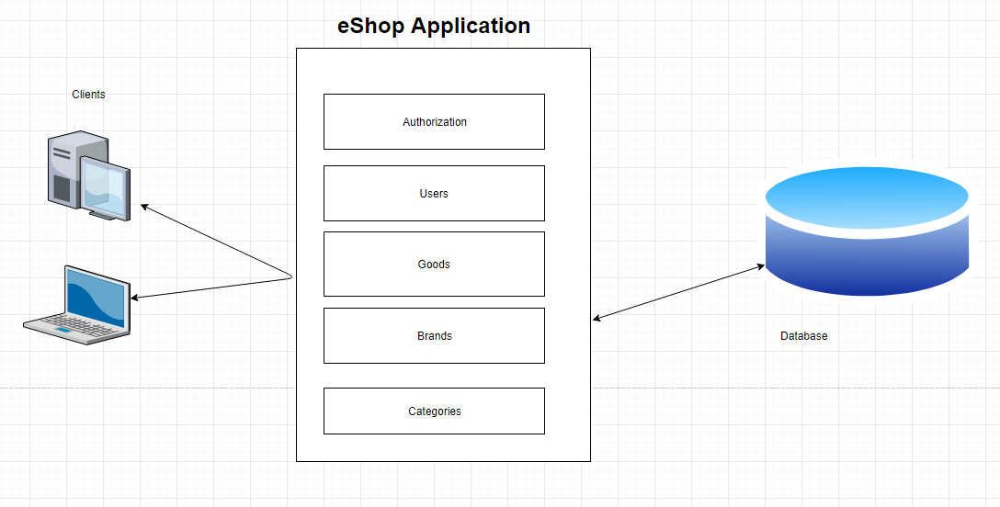
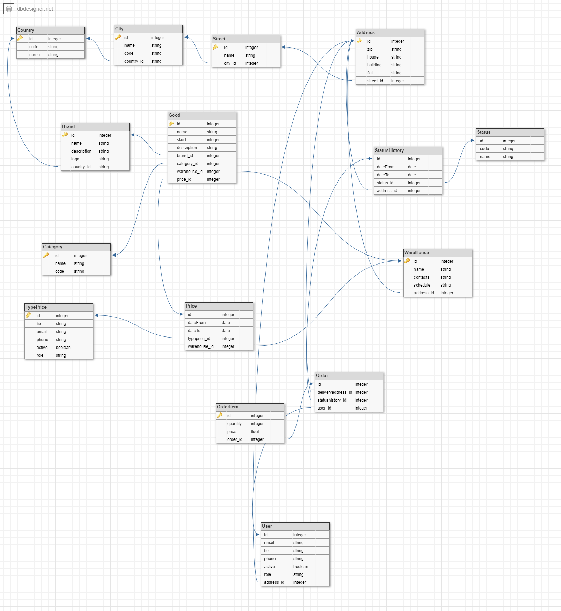

*Проект E-Shop*

Проект создан в рамках обучения курса Otus. Архитектор ПО
и представляет собой монолитное web-приложение.

Архитектурная схема представлена ниже.

Технологический стек Spring/Spring Boot. В качестве базы данных используется h2
Для входа в приложение используются следующие параметры
|===
|Параметр |Значение

|Администратор|admin@mail.ru/12345
|Пользователь |test2@mail.ru/12345
|Точка входа  |http://localhost:8082/swagger-ui.html
|===

На первом этапе созданы следующие сущности
|===
|Пользователь
|Товар
|Заказ
|Корзина (Корзина в настоящий момент считается заказом с особым статусом)
|===

Модель данных представлена ниже

Архитектурно проект разделен на следующие пакеты

- *domain*      структуры данных
- *repository*  jpa-репозитории
- *service*     сервисы
- *controller*  контроллеры. В настоящее время наружу выведены контроллеры Country,User, Good, WareHouse
- *security*    Для авторизации используется basic-авторизация

Все методы GET для Country, Good, WareHouse открыты для всех

Остальные методы открыты только для администратора системы

Во втором ДЗ добавлены два сервиса для отправки уведомлений: PushService и EmailService
Каждый из сервисов получает свои параметры

*PushService*
|===
|Параметр |Значение
|phone|Номер телефона
|text|Сообщение
|===

*EmailService*
|===
|Параметр |Значение
|to|Адресат
|subject|Заголовок письма
|text|Текст письма
|===

Для вызова этих сервисов сделан общий сервис SendMessage и контроллер MessageController

Первый элемент вызова котроллера - тип события push/email

Второй элемент - массив свойств из таблиц указанных выше

*Доступ к БД*

База данных доступна по ссылке http://localhost:8082/h2-console[localhost:8082/h2-console]

url   jdbc:h2:mem:testdb

Пользователь sa

Пароль не установлен

